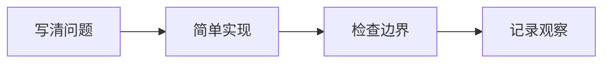

# 在代码与蓝天之间，写下第一篇手记

下午把手边的代码暂时放下，抬头看了一会儿窗外的天空。一个想法突然变得清晰：除了把问题解决，我也想把思考的过程留下来。

这篇文章是手记的第一篇示例，也是一张小小的排版试纸。之后，这里会慢慢装下学习笔记、实验记录，以及偶尔从日常里冒出来的灵感。

## 为什么开始记录

很多时候，真正值得记住的不是最后的答案，而是走到答案之前的几次尝试。一次报错、一段绕远路的推导，或一个突然成立的猜想，都是学习的一部分。

**把问题写下来，往往就是理解它的第一步。**[^write] 写作让模糊的念头有了轮廓，也让我有机会重新审视那些以为自己已经明白的事情。

> 不必等到想明白了一切才开始写。
>
> 让文字跟着思考一起生长，也是一种很好的记录方式。

我希望这里的文字可以保留一点轻松：既容得下认真的技术讨论，也装得下一句 _「今天的天空很好看」_。

## 从一个小问题出发

学习一项新技术时，我习惯先找一个足够小的例子。它不需要复杂，但最好能完整地走过「提出问题、验证想法、解释结果」这条路。

### 先把过程拆开

1. 写清楚输入和想得到的结果。
2. 实现一个容易理解的版本。
3. 检查边界情况，再考虑优化。
4. 记录观察到的现象，而不只记录结论。

例如，一个最简单的向量加法可以写成下面这样。这里关注的是表达过程，**不是性能基准**。

```python
def add_vectors(left: list[float], right: list[float]) -> list[float]:
    """将两个等长向量逐项相加。"""
    if len(left) != len(right):
        raise ValueError("两个向量需要有相同的长度")

    return [a + b for a, b in zip(left, right)]


result = add_vectors([1.0, 2.0, 3.0], [4.0, 5.0, 6.0])
print(result)  # [5.0, 7.0, 9.0]
```

在这个例子里，`len(left) != len(right)` 是一个很小的检查，却明确了函数的使用边界。简单的实现可以成为后续并行版本的参照，而不是被匆匆跳过的步骤。

对长度为 $n$ 的向量，这个实现需要 $O(n)$ 次加法：

$$
(a + b)_i = a_i + b_i,\quad i = 0, 1, \ldots, n-1
$$

这些步骤也可以画成一条很短的路径：



### 给观察留一个位置

我想慢慢养成这些习惯：

- 保留最初的问题描述。
- 给重要的代码补上可复现的运行方式。
- 区分「亲自观察到的结果」和「尚待验证的猜想」。
  - 没有测量时，不轻易声称某个方案更快。
  - 有了测量后，也写清楚环境与输入。
- ~~只留下最终答案。~~ 也记录中途有价值的弯路。

## 一张小小的学习地图

下面不是进度承诺，只是给好奇心标出几个方向。

| 方向         | 想弄明白的问题                 | 可以从哪里开始               |
| :----------- | :----------------------------- | :--------------------------- |
| 高性能计算   | 如何让多个计算单元更好地协作？ | 线程组织、内存访问与基础测量 |
| 科学计算     | 近似计算的误差从哪里来？       | 简单的数值方法与误差分析     |
| 机器学习系统 | 模型之外还有哪些系统问题？     | 数据流、运行环境与计算资源   |

这些方向之间也有许多交集。学到某个新概念时，我希望能多问一句：它与已经理解的东西，有没有关系？

## 也给生活留一点空白


一张蓝白色的插画，作为这篇文章的书签。这里没有紧迫的更新计划，只有一些值得慢慢整理的念头。

<details>
<summary>一个写给未来自己的小提醒</summary>
<p>写得少一点也没关系。清楚地讲完一个问题，比一次写下很多还没想明白的事情更有意义。</p>
</details>

## 下一页，慢慢来

这篇示例文章也顺便检查了几种常见的表达形式：

- [x] 段落、标题与引用
- [x] 有序列表、无序列表与任务清单
- [x] 代码、表格与图片
- [x] 行内公式与独立公式
- [x] Mermaid 示意图
- [x] 脚注
- [ ] 留待以后慢慢补充的新故事

如果你也想一起交流，欢迎去 [我的 GitHub](https://github.com/Alicia24012867)，或 [写一封信](mailto:hyb24@mails.tsinghua.edu.cn)。

---

愿我们既能认真地解决问题，也能偶尔抬头看看蓝天。

[^write]: 这里说的写作，不一定是发表。先写给自己看，也很好。
